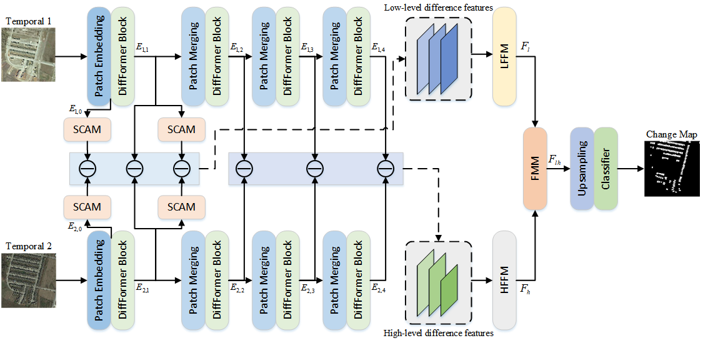

# MDGF-CD: Multi-Level DiffFormer Feature Grouping Fusion Network
Here, we provide the pytorch implementation of the paper: MDGF-CD: Land-cover change detection with multi-level DiffFormer feature grouping fusion for VHR remote sensing images.

For more information, please see our published paper at [Information Fusion](https://www.sciencedirect.com/science/article/pii/S1566253525001836).



## Data structure

```
├─A
├─B
├─label
└─list
```

## Citation

If you use this code for your research, please cite our paper:

```
@article{liu2025mdgf,
  title={MDGF-CD: Land-cover change detection with multi-level DiffFormer feature grouping fusion for VHR remote sensing images},
  author={Liu, Jamin and Xu, Rui and Duan, Yule and Guo, Tan and Shi, Guangyao and Luo, Fulin},
  journal={Information Fusion},
  pages={103110},
  year={2025},
  publisher={Elsevier}
}
```

## License

Code is released for non-commercial and research purposes **only**. For commercial purposes, please contact the authors.

## Disclaimer
Appreciate the work from the following repository:
- https://github.com/wgcban/ChangeFormer (Our MDGF-CD is implemented on the code provided in this repository).
